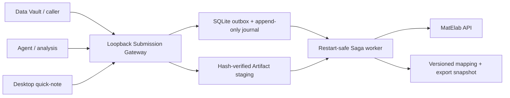

# Architecture

## Authority and boundaries

- The caller owns experiment discovery and all submitted semantics. The bridge never scans Data Vault, repositories, Conda, shell history, or arbitrary directories.
- MatElab owns the record and finalized version. The bridge stores the exact response reference plus a hash and local snapshot of every verified export.
- Manager is outside this process. There is no Manager client, credential, Evidence/Issue model, callback, or backlink in this repository.
- A `202` commit means the complete declared package is durable locally. It does not mean MatElab synchronization has completed.

## Recovery model

The worker uses a Saga, not a distributed transaction. Every remote call is preceded by a durable state transition and followed by a receipt. A process restart moves in-flight tasks back to `ready`; stable upload names and record UIDs allow the worker to reconcile before it creates a record. The bridge never calls MatElab delete as automatic compensation.

The one unavoidable uncertainty is a process failure after MatElab accepted a file chunk but before the local receipt committed. The upload uses the same `uid/name/hash` on retry. Its exact production behavior is therefore a Gate 0 test; a non-idempotent server must be handled as reconciliation, not silent recreation.

