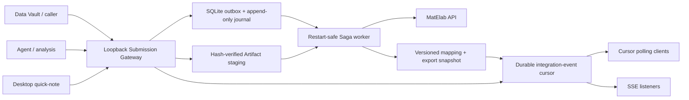

# Architecture

## Authority and boundaries

- The caller owns experiment discovery and all submitted semantics. The bridge never scans Data Vault, repositories, Conda, shell history, or arbitrary directories.
- MatElab owns the record and finalized version. The bridge stores the exact response reference plus a hash and local snapshot of every verified export.
- Manager is outside this process. There is no Manager client, credential, Evidence/Issue model, callback, or backlink in this repository.
- A `202` commit means the complete declared package is durable locally. It does not mean MatElab synchronization has completed.
- Integration events are a separate public stream rather than a projection of the internal Saga journal. `matelab.record.synced` is inserted atomically with the final `complete` transition. Consumers can replay from a numeric cursor before switching to SSE.
- The Connector does not call consumer-provided webhook URLs. This avoids turning a desktop process into an outbound request proxy and avoids webhook registration, secret distribution, and retry ownership. A remote service can run a small authenticated relay next to the Connector if push across machines is required.

## Existing-record descriptions

`POST /v1/records/{record_uid}/descriptions` reserves an idempotency key and deterministic rich-text module name in SQLite before calling MatElab `/eln_api/update`. If the HTTP result is uncertain, the caller retries with the same key and body; MatElab documents `addModule` with an existing name as a no-op, so the retry does not create a second module. The Connector stores only the content hash in its operation ledger and integration event, not the description body.

This endpoint is synchronous: success means the MatElab API acknowledged the update, not merely that it entered the capture outbox. MatElab's documented collaborative-editing caveat still applies: when another editor has the record open, that editor may need to save the active version.

## Recovery model

The worker uses a Saga, not a distributed transaction. Every remote call is preceded by a durable state transition and followed by a receipt. A process restart moves in-flight tasks back to `ready`; stable upload names and record UIDs allow the worker to reconcile before it creates a record. The bridge never calls MatElab delete as automatic compensation.

The one unavoidable uncertainty is a process failure after MatElab accepted a file chunk but before the local receipt committed. The upload uses the same `uid/name/hash` on retry. Its exact production behavior is therefore a Gate 0 test; a non-idempotent server must be handled as reconciliation, not silent recreation.
